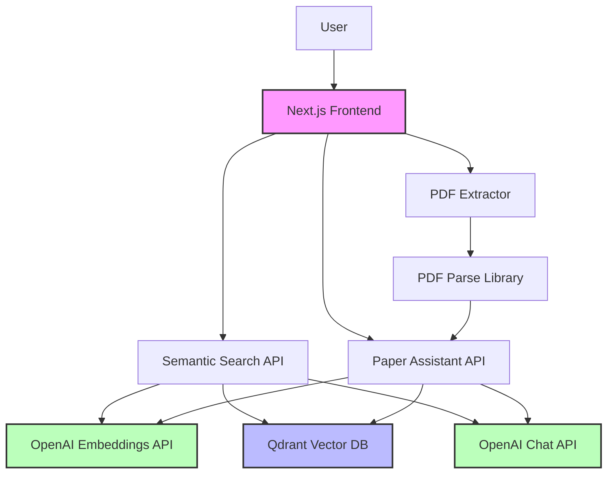

# ISU Semantic Search

[](https://isu-digital-lib-random-hash.a.run.app)
[](https://nextjs.org/)
[](https://openai.com/)
[](https://qdrant.tech/)
[](#license)

A Retrieval Augmented Generation (RAG) application for Iowa State University's Computer Science department academic papers and research documents.


## Project Overview

ISU Semantic Search enables natural language querying of Iowa State University's academic research repository. The system uses advanced semantic search capabilities and OpenAI's large language models to provide context-aware responses based on the repository's content.

<a href="https://isu-digital-lib-random-hash.a.run.app">
  
</a>

### Key Features

1. **Semantic Search**
   - Natural language query processing
   - Context-aware document retrieval
   - Document similarity matching
   - Relevance ranking with citation support

2. **Paper Assistant**
   - Upload your own PDF papers
   - Ask questions about specific papers
   - Get contextual answers based on paper content
   - Citations to relevant sections

3. **Document Processing**
   - Automatic PDF parsing and text extraction
   - Text chunking for optimal embedding
   - Vector embedding generation
   - Metadata extraction

4. **RAG Implementation**
   - OpenAI embeddings integration (`text-embedding-3-small` model)
   - Qdrant vector database storage
   - Context-aware response generation
   - Source citations

## Architecture

ISU Semantic Search follows a Next.js application architecture with RAG components. The system uses:

- **Frontend**: Next.js 15 with App Router
- **UI Framework**: Tailwind CSS with shadcn/ui components
- **Vector Database**: Qdrant
- **Embedding Model**: OpenAI text-embedding-3-small
- **Completion Model**: OpenAI gpt-4o / gpt-3.5-turbo
- **PDF Processing**: pdf-parse
- **Containerization**: Docker
- **Deployment**: Google Cloud Run

The project currently has a monolithic architecture with dedicated API routes for semantic search and assistant functionality.

### System Architecture Diagram



## API Endpoints

- `POST /api/semantic/search`: Semantic search for papers in the repository
- `POST /api/semantic/ask`: Question answering based on repository content
- `POST /api/assistant/upload`: Upload paper content
- `POST /api/assistant/extract-pdf`: Extract text from PDF files
- `POST /api/assistant/ask`: Question answering based on uploaded papers
- `POST /api/assistant/cleanup`: Clean up uploaded papers
- `GET /api/health`: Check system health and configuration

## Setup and Deployment

### Prerequisites

1. Node.js (>=20.x)
2. npm/yarn or another package manager
3. OpenAI API key
4. Qdrant instance (cloud or self-hosted)

### API Keys Required

1. **OpenAI API Key**
   - Used for: Embeddings and completion models
   - Obtain from [OpenAI platform](https://platform.openai.com/)

2. **Qdrant API Key**
   - Used for: Vector database operations
   - Obtain from: Self-hosted or [Qdrant Cloud](https://qdrant.tech/)

### Environment Setup

Create a `.env` file in the root directory with the following content:

```
# Required API Keys
MY_OPENAI_API_KEY=your_openai_key
QDRANT_URL=your_qdrant_url
QDRANT_API_KEY=your_qdrant_key

# Optional Configuration
NODE_ENV=production
```

### Running Locally

```bash
# Install dependencies
npm install

# Run development server
npm run dev
```

### Running with Docker

```bash
# Build Docker image
docker build -t isu-semantic-search .

# Run container
docker run -p 3000:3000 --env-file .env isu-semantic-search
```

### Deployment to Google Cloud Run

This project is configured for deployment to Google Cloud Run using Cloud Build:

1. Set up a Google Cloud project and enable Cloud Build and Cloud Run
2. Set up the required environment variables in Cloud Build
3. Push to the main branch or run the workflow manually

### Deployment Status

| Environment | Status | URL |
|-------------|--------|-----|
| Production |  | [isu-digital-lib-random-hash.a.run.app](https://isu-digital-lib-random-hash.a.run.app) |


## Diagnostic Tools

The project includes diagnostic tools to help troubleshoot issues:

```bash
# Run diagnostic script to check OpenAI and Qdrant connectivity
node src/scripts/diagnostic.js
```

## Usage Guide

### Semantic Search Tab

1. Enter your query in the search box
2. View the list of relevant papers with abstracts and citations
3. Click on a paper to view more details or access the full document

### Paper Assistant Tab

1. Upload academic papers in PDF format
2. Wait for the papers to be processed and embedded
3. Ask questions about the papers' content
4. View AI-generated answers with citations to the relevant papers

## Development

### Project Structure

```
isu-semantic-search/
├── frontend/             # Next.js frontend application
│   ├── public/           # Static files
│   ├── src/              # Source code
│   │   ├── app/          # Next.js App Router
│   │   │   ├── api/      # API routes
│   │   │   └── layout.tsx
│   │   ├── components/   # React components
│   │   ├── lib/          # Utility functions
│   │   └── scripts/      # Scripts for data processing
│   ├── .env              # Environment variables
│   ├── Dockerfile        # Docker configuration
│   └── package.json      # Dependencies
├── .github/              # GitHub configuration
│   └── workflows/        # GitHub Actions
├── cloudbuild.yml        # Cloud Build configuration
├── Dockerfile            # Root Docker configuration
└── README.md             # Project documentation
```

### Technology Stack


### Contributing

1. Fork the repository
2. Create a feature branch
3. Make your changes
4. Open a pull request

## Project Status


### Roadmap

- [ ] Microservice architecture
- [ ] Advanced search filters by department, year, and document type
- [ ] Improved document processing for various file formats
- [ ] Enhanced citation management
- [ ] Integration with ISU's digital repository API
- [ ] User authentication and personalized search history

## Performance Metrics

| Metric | Value |
|--------|-------|
| Average Query Response Time | < 3 seconds |
| PDF Processing Time | ~5-10 seconds per document |
| Max PDF Size | 10 MB |
| Vector Dimensions | 1536 |
| Max Concurrent Users | 100 |

## License

This project is proprietary and intended for use by Iowa State University.

## Support and Contact

For support, you have the following options:

- Technical Issues: Open an issue on this repository
- General Questions: Shobhit Sarkar, Dr Adisak Sukul
- API Integration: View the API documentation at `/api/docs`

For more information, contact the development team at [shobhitsarkar0802@gmail.com](mailto:shobhitsarkar0802@gmail.com)

---

### Contribution Statistics: 

## Contributors


<div align="center">
  <p>© 2025 Iowa State University. All Rights Reserved.</p>
</div>
